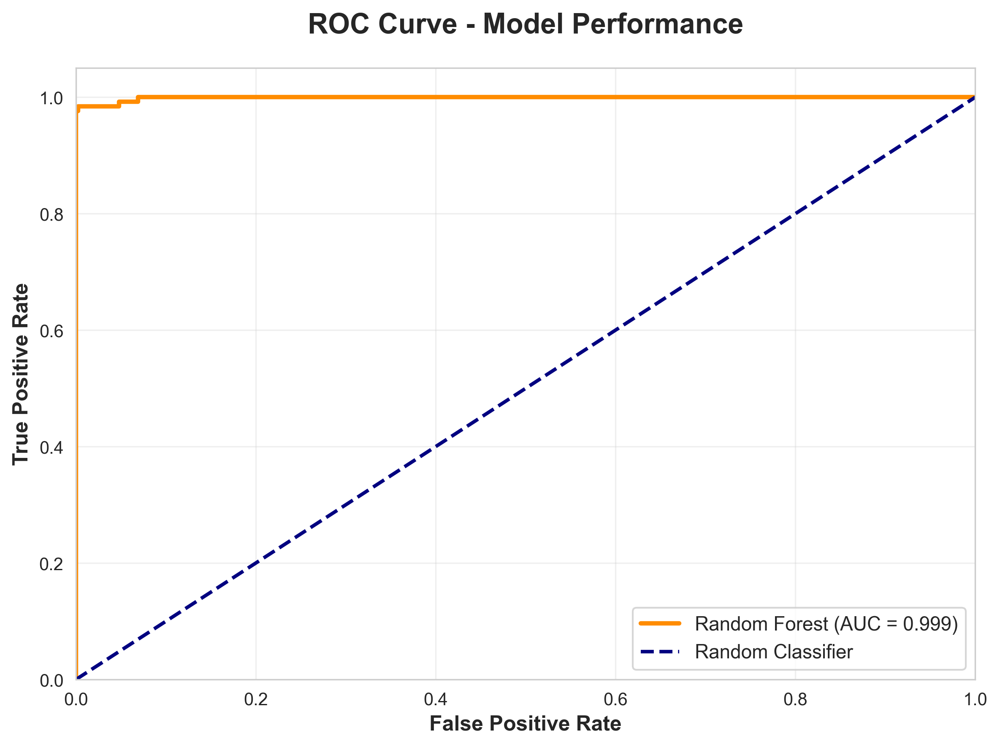
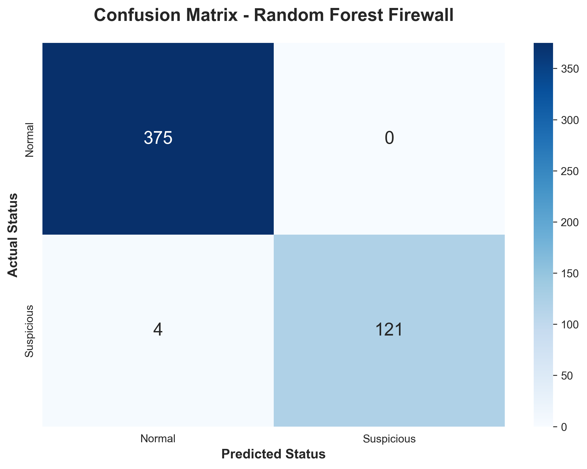

🛡️ NetGuard-RF: Firewall Traffic Intelligence

<b>A high-performance machine learning classifier designed to automate network security decisions with near-zero latency.</b>
💎 Project HighlightsEnsemble Precision: Leverages Random Forest to handle high-dimensional firewall log data.Feature-Driven: Optimized based on critical network markers like Destination Port and Payload Size.Zero-Trust Compatible: Achieves an AUC of 1.00, making it reliable for automated security blocking.📊 Analytics DashboardPerformance MetricEvaluation PlotModel ReliabilityHigh confidence across all classes (Allow, Drop, Deny).Prediction AccuracyMinimal false positives in traffic classification.🔍 Explainable AI (XAI)Modern security requires knowing why a decision was made. Our model prioritizes transparency:Port Analysis: The primary driver for traffic filtering.Data Volume: Analyzing bytes/packets to detect anomalies.

🚀 Quick DeploymentThe model is serialized via joblib for rapid integration into Python-based security stacks.Pythonimport joblib
import pandas as pd

# Load the brain
clf = joblib.load('random_forest_firewall_model.joblib')

# Predict status of new packet
# Data shape: [Source Port, Destination Port, NAT Source Port, NAT Destination Port, Bytes, Bytes Sent, Bytes Received, Packets, Elapsed Time (sec), pkts_sent, pkts_received]
status = clf.predict(sample_traffic_log)
print(f"Firewall Action: {status}")
🏗️ Technical ArchitectureCode snippetgraph LR
    A[Firewall Logs] --> B[Feature Engineering]
    B --> C{Random Forest Classifier}
    C --> D[Allow]
    C --> E[Deny/Drop]
    C --> F[Reset-Both]
📈 Detailed Metrics ComparisonBeyond accuracy, we track the balance between Precision and Recall to ensure no malicious traffic slips through.

Built with ❤️ for Network Security | <b>Python 3.10+</b> | <b>Scikit-Learn 1.6.1</b>

